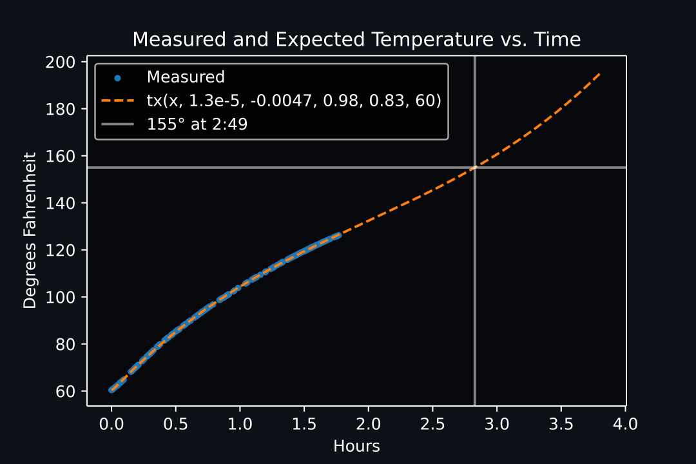

# Thermometer

Thermometer does extrapolation on time and temperature data to estimate when your meat will reach your desired cooking temperature.

* Automatically estimate cooking time without fancy thermometers or apps.
* Import spreadsheet or manually enter temperature data.
* Understand more about the accuracy and reliability of the estimation.


*Illustrates the `estimate()` function with measured data in blue and the estimated future data in orange*

---

## Installation

1. Download the project from [GitHub](https://github.com/DevinBerchtold/Thermometer)
2. Install the required Python libraries:
    * [SciPy](https://scipy.org/)
    * [pandas](https://pandas.pydata.org/)
    * [Matplotlib](https://matplotlib.org/stable/index.html)
    * [NumPy](https://numpy.org/doc/stable/)

    If you install SciPy, that should be all you need ([scipy.org/install](https://scipy.org/install/)):

    ```
    python -m pip install --user numpy scipy matplotlib ipython jupyter pandas sympy nose
    ```

---

## Usage

1. Start cooking and save your temperature data (or try an included .csv)
2. Import [`thermometer.py`](#thermometerpy) and create a `Thermometer` object from your .csv
3. Run `Thermometer.estimate()` to predict future temperatures. (See [`test.ipynb`](#testipynb) for examples)

---

## Files

### thermometer.py

Defines the `Thermometer` class which contains time and temperature data from an imported .csv file. Has the `estimate()` member function which predicts the time a `Thermometer` will reach a given temperature.

### main.py

Find csv files with today's date and import the most recent one. Do some common estimations quickly. This is the quickest way to import temperatures and estimate quickly white cooking.

### test.ipynb

Contains demonstrations and analysis of different uses of the `Thermometer` class and `estimate()` function.


---

## Temperature Data

`Thermometer` requires a list of temperatures and the times they were recorded. Some thermometers have the ability to export a spreadsheet or .csv file. If that's not avaliable, you can manually measure and enter datapoints into a spreadsheet.

Depending on what you're cooking and how fast the temperature changes, you will probably need about an hour of data to get a good estimate.

---

## Curve Fit Performance

`Thermometer` uses `scipy` functions `curve_fit` and `fsolve` to fit an arbitrary function to the measured data and then extrapolate that function and predict future values. A 3rd order polynomial usually fits well, but it's improved by adding a `+cx^-1` term to the objective function:

```python
def tx(x, a, b, c, d, e):
    return (a*(x**3))+(b*(x**2))+(c*x)+(d*((1+x)**-1))+e
```

---

## Example Cooks

### Pork

Boneless pork shoulder with probe inserted into the center, estimated almost 2 hours before done time.


### Turkey

Spatchcocked turkey with probe inserted into the breast, estimated about 1 hour before done time. *Note: The FDA recommends poultry be cooked to at least 165° internal temperature, but it will probably be dry*



---

## Todo

- [x] Basic estimation
- [ ] Improve fit function
    - [ ] Constrain `curve_fit` so `f(x)` and `f'(x)` have correct value at last sample
    - [ ] Detect and remove anomolies in input data
    - [ ] Use ambient temperature in calculations
- [ ] More options for inputing temperature data (realtime mode)

---

## Credits

Temperature data gathered with an [Inkbird IBBQ-4T](https://inkbird.com/collections/all/products/wifi-grill-thermometer-ibbq-4t)

---

## License

This project is released under the MIT license:

[MIT License](https://choosealicense.com/licenses/mit/)