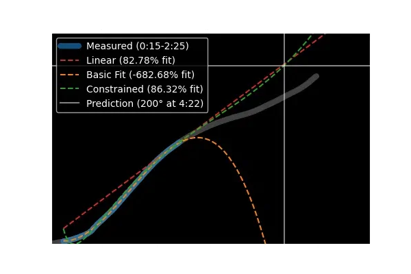
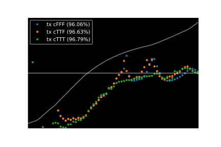
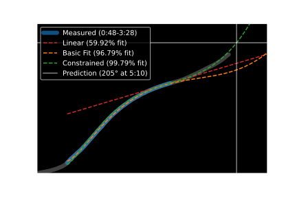
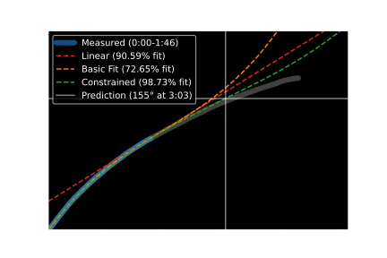

# TempFit

TempFit does extrapolation on time and temperature data to estimate when your meat will reach your desired cooking temperature.

* Automatically estimate cooking time without fancy thermometers or apps.
* Import spreadsheet or manually enter temperature data.
* Understand more about the accuracy and reliability of the estimation.

<p align='center'><picture>
  <source media="(prefers-color-scheme: light)" srcset="plots/animation_light.webp">
  
</picture></p>

*Illustrates the `estimate()` function with measured data in blue and the approximation functions in red, orange, and green*

---

## Installation

1. Download the project from [GitHub](https://github.com/DevinBerchtold/TempFit)
2. Install the required Python libraries:
    * [SciPy](https://scipy.org/)
    * [pandas](https://pandas.pydata.org/)
    * [Matplotlib](https://matplotlib.org/stable/index.html)
    * [NumPy](https://numpy.org/doc/stable/)

    If you install SciPy, that should be all you need ([scipy.org/install](https://scipy.org/install/)):

    ```
    python -m pip install --user numpy scipy matplotlib ipython jupyter pandas sympy nose
    ```

---

## Usage

1. Start cooking and save your temperature data with an electronic thermometer or using [`manual.py`](#manualpy)
2. Import [`thermometer.py`](#thermometerpy) and create a `Thermometer` object from your CSV
3. Run `Thermometer.estimate()` to predict future temperatures. (See [`test.ipynb`](#testipynb) for examples)

---

## Temperature Data

`Thermometer` requires a list of temperatures and the times they were recorded. Some thermometers have the ability to export a spreadsheet or CSV file. If that's not available, you can manually measure and enter data points into a spreadsheet with the help of [`manual.py`](#manualpy).

Depending on what you're cooking and how fast the temperature changes, you will probably need about an hour of data to get a good estimate.

---

## Estimation Accuracy

### Model Function

`estimate()` works by fitting a model function to measured temperature data and extrapolating to predict future values. A 3rd order polynomial usually fits well, but it's improved by adding an `x⁻¹` term to the objective function:

```python
def tx(x, a, b, c, d, e):
    return a*x**3+b*x**2+c*x+d*(1+x)**-1+e
```

The improvements can be easily seen when we plot the ETA at many points throughout the cook. The improved function is closer to correct eta (horizontal line) on average:

<p align='center'><picture>
  <source media="(prefers-color-scheme: light)" srcset="plots/summary_functions_light.svg">
  
</picture></p>

### Constraints

The result is improved by adding constraints to the fitting function. Some improvement can be obtained by constraining the value and slope of the model function to be what they were at the last measured point (`y[-1]=f(x[-1])` and `y'[-1]=f'(x[-1])`). This is logical because the current temperature and rate of change of temperature will have the biggest effect on future values.

<p align='center'><picture>
  <source media="(prefers-color-scheme: light)" srcset="plots/summary_constraints_light.svg">
  
</picture></p>


The third constraint is designed specifically for barbecue. It accounts for the '[barbecue stall](https://www.google.com/search?q=barbecue+stall)', a common observation that the temperature increase usually slows around 150-160 °F and speeds up after. This phenomenon represents an inflection point in the temperature vs time graph so it can be modeled by constraining the second derivative to be zero around 155 (`f"(x)=0 when f(x)=155`). A rough guess of 155 °F shows a big improvement in estimation, but this value can probably be further tuned.

---

## Files

### thermometer.py

Defines the `Thermometer` class which contains time and temperature data from an imported CSV file. Has the `estimate()` member function which predicts the time a `Thermometer` will reach a given temperature.

### main.py

Find CSV files with today's date and import the most recent one. Do some common estimations quickly. This is the quickest way to import temperatures and estimate quickly white cooking.

### manual.py

Manually enter temperature values for extrapolation. They will be automatically timestamped and saved in a CSV file for quick calculations while cooking.

### test.ipynb

Contains demonstrations and analysis of different uses of the `Thermometer` class and `estimate()` function.


---

## Example Cooks

### Pork :pig:

Boneless pork shoulder with probe inserted into the center, estimated almost 2 hours before done time.

<p align='center'><picture>
  <source media="(prefers-color-scheme: light)" srcset="plots/pork_light.svg">
  
</picture></p>


### Turkey :chicken:

Spatchcocked turkey with probe inserted into the breast, estimated about 1 hour before done time.

<p align='center'><picture>
  <source media="(prefers-color-scheme: light)" srcset="plots/turkey_light.svg">
  
</picture></p>

> *Note:* The FDA recommends poultry be cooked to at least 165° internal temperature, but it will probably be dry. See [this article](https://www.seriouseats.com/butterflied-roasted-chicken-with-quick-jus-recipe) by J. Kenji López-Alt for more information.

---

## Todo

- [x] Basic estimation
- [ ] Improve fit function
    - [x] Constrain `curve_fit` so `f(x)` and `f'(x)` have correct value at last sample
    - [ ] Detect and remove anomalies in input data
    - [ ] Use ambient temperature in calculations
- [x] More options for inputting temperature data (realtime mode)

---

## Credits

Temperature data gathered with an [Inkbird IBBQ-4T](https://inkbird.com/collections/all/products/wifi-grill-thermometer-ibbq-4t)

---

## License

This project is released under the MIT license:

[MIT License](https://choosealicense.com/licenses/mit/)